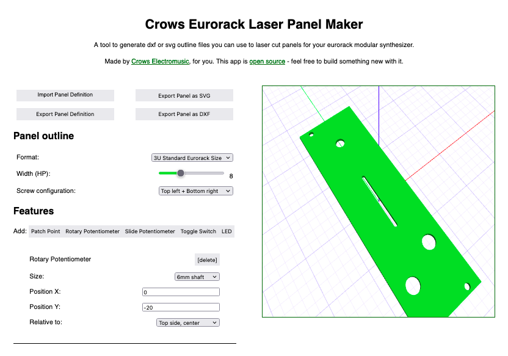

# Crows Eurorack Laser Panel Maker
#### by [Crows Electromusic](https://crowselectromusic.com)

A simple web app to generate front panels for modular synthesizers using a laser cutter. 

Inspired by [MakerCase](https://www.makercase.com/), and based on the simply *amazing* [JSCAD](https://github.com/jscad/OpenJSCAD.org), which is in turn based on the delightful, but desktop-only, [OpenSCAD](https://openscad.org/).

Interface stuff is done with [AlpineJS](https://alpinejs.dev/), because I wanted to take that for a spin. It's a bit opaque and "magical" but it's worked well for quickly developing this.

It uses `yarn` for package management, and `parcel` for bundling the various modules up for the web, but you don't need to worry about that unless you're diving deep. To get started, all you need to know is:

## Development Guide

1. If you don't have it already, [install yarn](https://yarnpkg.com/getting-started/install).
2. In the root project directory, run `yarn install` - this fetches all the dependencies (mostly openjscad + alpinejs)
3. To run the development server, run `yarn start`, visit the URL it spits out. The page will auto-reload if you make changes.
4. To output build files to the `./dist` directory, run `yarn build`.

### TODOs:

1. Lookup data for features - rotary pot shaft sizes,encoder shaft sizes, slide pot lengths and widths, toggle switch sizes, led size
2. Add margins to all my holes, most will need extra space, LEDs might need less?
3. CHECK OVAL HOLE WIDTH ON A REAL MODULE
4. Look into importing some model files, which could be rendered in place to really get the experience (i.e. not just a panel w holes)
8. add a switch to toggle the "doepfer inset" vs nominal width on and off - need this because 1U PulpLogic is pricisely xHP wide, no weird insets - eurorack and intellijel are not

#### Features that would be nice but I am not currently working on (pull requests welcome):

  - graphics / logos
  - knob caps / fader caps
  - displays (LCD, 8-segment)
  - header pins
  - generic hole / round-rect / rect cutouts for whatever you want
  - PCB outline exporting (w or w/o marks for where features should go)
  - laser kerf, adjustable margins
  - re-order features with up & down buttons
  - port the whole thing to typescript for sanity's sake, my god js is a hellhole
  - a visual catelogue of parts, with links to where they come from / data sheets

## Guidelines for derivative works

This code is licensed under the GPLv3.0

Under the GPL, any work you create that derives from or incorporates this work MUST be also open source and licensed under the GPL. Share and share-alike!
